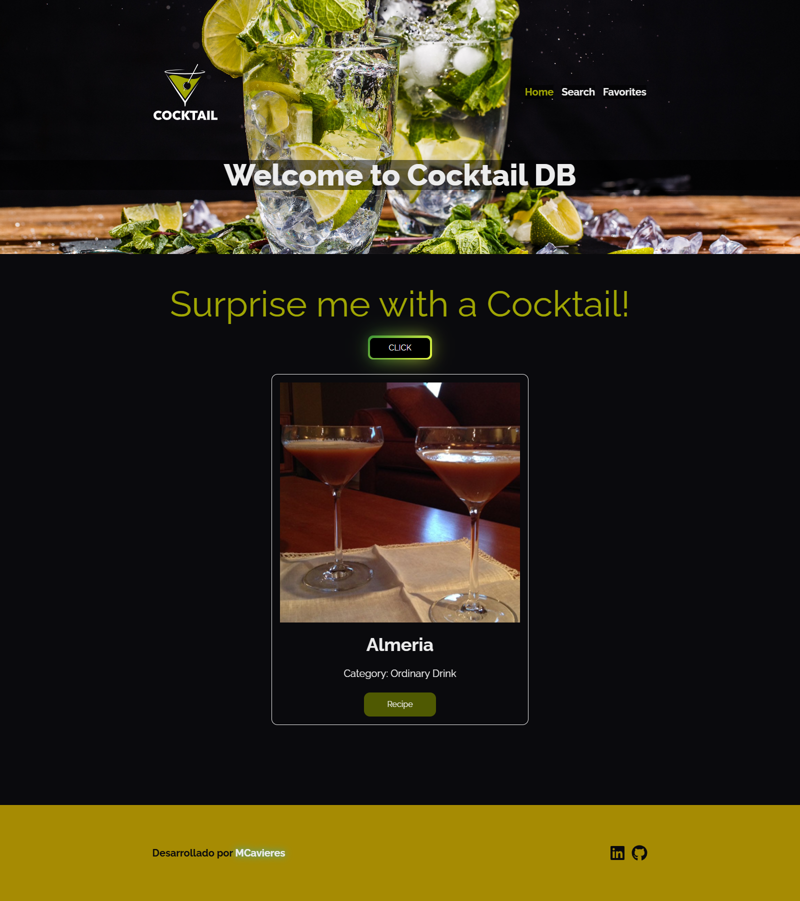
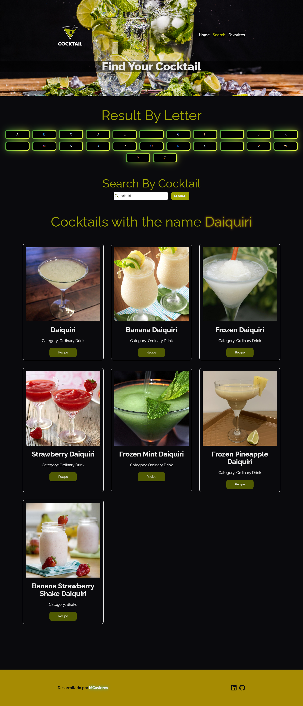
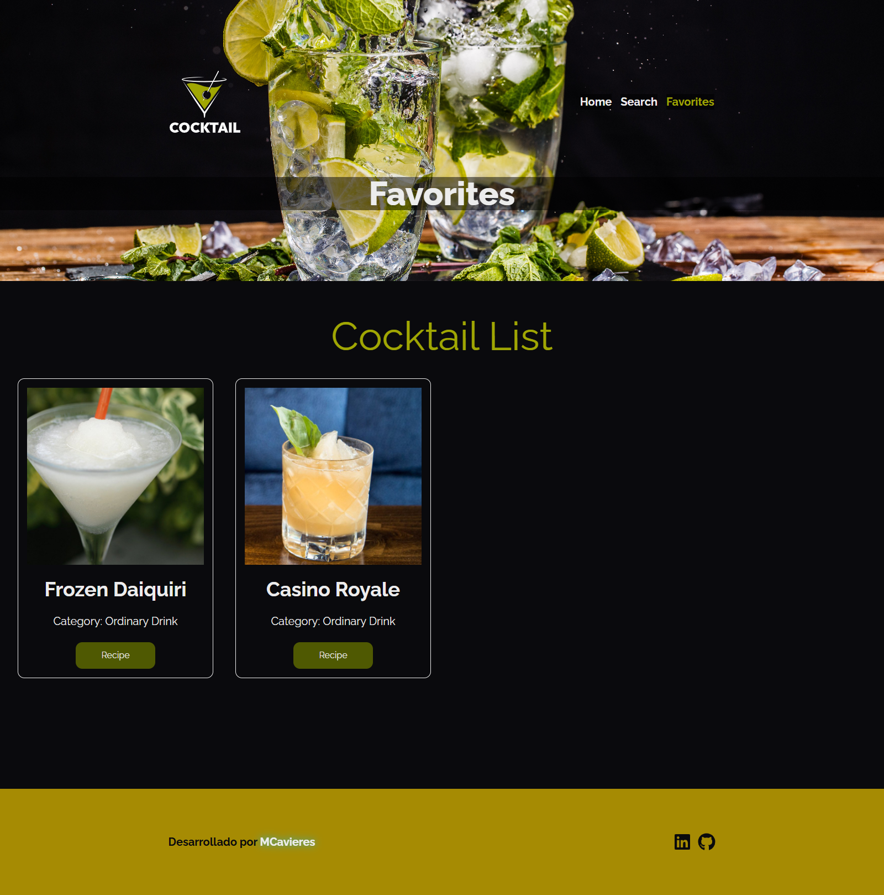
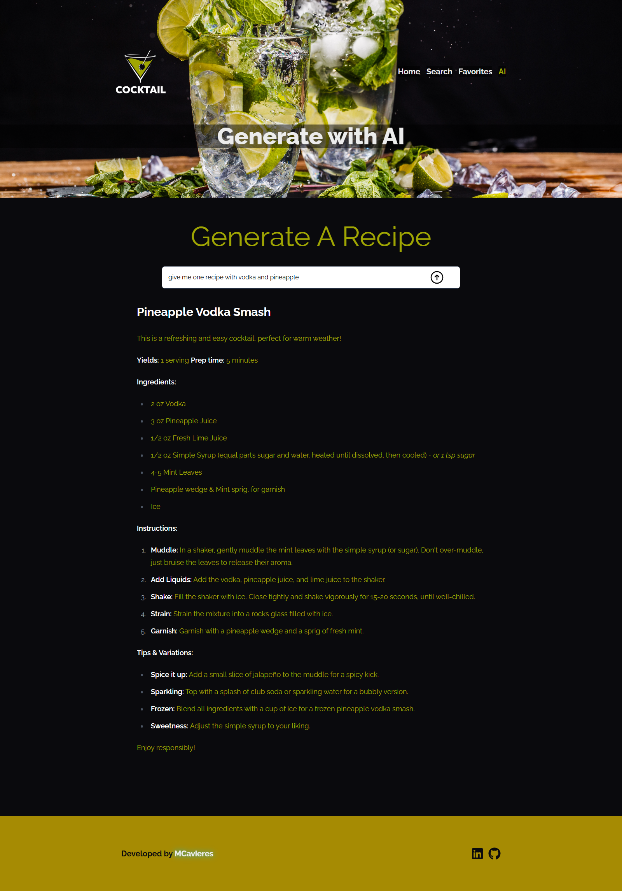

# Cocktail DB

Aplicación web para explorar recetas de cócteles, con opciones de búsqueda, selección de favoritos, sorprender al usuario con recetas aleatorias y **generación de recetas a través de la Inteligencia Artificial**.

Para ver el proyecto de click [aquí](https://macarenacavieres.github.io/cocktail-db-v2/#/)

## Tabla de Contenidos

-   [Descripción](#descripción)
-   [Características](#características)
-   [Tecnologías Utilizadas](#tecnologías-utilizadas)
-   [Estructura del Proyecto](#estructura-del-proyecto)
-   [Instalación](#instalación)
-   [Uso](#uso)
-   [Autor](#autor)

## Descripción

Cocktail DB es una aplicación desarrollada en React que permite a los usuarios:

-   Buscar cócteles por nombre o por letra inicial.
-   Ver una receta aleatoria de cóctel.
-   Agregar cócteles a una lista de favoritos.
-   Generar recetas.

El proyecto utiliza React Router para gestionar la navegación y Zustand para el estado global.

## Características

-   **Página Principal:** Muestra un cóctel aleatorio y permite al usuario pedir una nueva receta sorpresa.



-   **Búsqueda de Cócteles:** Permite buscar cócteles por nombre o seleccionar la primera letra.



-   **Favoritos:** Sección donde los usuarios pueden ver y gestionar sus cócteles favoritos.



-   **AI:** Sección donde los usuarios pueden generar sus propias recetas preguntándole a la inteligencia artificial.



-   **Interfaz Reactiva y Responsiva:** La interfaz se adapta a dispositivos móviles y de escritorio.

## Tecnologías Utilizadas

-   **React**
-   **React Router**
-   **Zustand:** Manejo del estado global.
-   **Heroicons:** Iconos SVG.
-   **Tailwind CSS:** Estilos CSS.
-   **OpenRouter:** Conexión con el proveedor de modelos de Inteligencia Artificial para generar recetas mediante lenguaje natural.
-   **API de Cócteles:** Servicios de cócteles para obtener datos.

## Estructura del Proyecto

-   **router.tsx:** Define las rutas de la aplicación con `BrowserRouter`, `Routes` y `Suspense` para cargar las vistas de manera asíncrona.
-   **layouts/Layout.tsx:** Componente principal que incluye el encabezado, pie de página, y un contenedor para las notificaciones y el modal.
-   **views/IndexPage.tsx:** Página de inicio que muestra una receta aleatoria y un botón para obtener una nueva.
-   **views/SearchPage.tsx:** Página de búsqueda donde el usuario puede buscar por nombre o seleccionar por letra.
-   **views/FavoritesPage.tsx:** Página de favoritos donde el usuario visualiza y gestiona sus cócteles favoritos.
-   **views/GenerateAIPage.tsx**: Página de generación de recetas a través de un modelo gratuito de Inteligencia Artificial
-   **stores/useAppStore.ts:** Gestión del estado global usando Zustand, incluyendo recetas aleatorias, favoritos, notificaciones y búsqueda.
-   **slices:** Módulos de Zustand que separan la lógica de negocio (por ejemplo, `randomSlice.ts` para recetas aleatorias).

## Instalación

1. Clona el repositorio:
    ```bash
    git clone https://github.com/MacarenaCavieres/cocktail-db-v2.git
    cd cocktail-db-v2
    ```
2. Instala las dependencias:
    ```bash
    npm install
    ```
3. Ejecuta el proyecto:
    ```bash
    npm start
    ```
4. Accede a la aplicación en http://localhost:3000.

## Uso

-   En la página principal, haz clic en "Surprise me with a Cocktail!" para ver una receta aleatoria.
-   Usa la página de búsqueda para encontrar cócteles por nombre o letra inicial.
-   Agrega cócteles a favoritos y gestiona tu lista en la sección de favoritos.
-   En la sección **AI**, escribe un prompt en lenguaje natural con los ingredientes o estilo de cóctel que deseas (por ejemplo: `"Cocktail with gin, cucumber and mint"`), y luego haz clic en el ícono de enviar. La inteligencia artificial conectada mediante OpenRouter generará una receta personalizada basada en tu solicitud. Cabe destacar que tiene un límite de solicitudes.

## Autor

Desarrollado por [MCavieres](https://www.linkedin.com/in/macarena-cavieres-rubio/)
